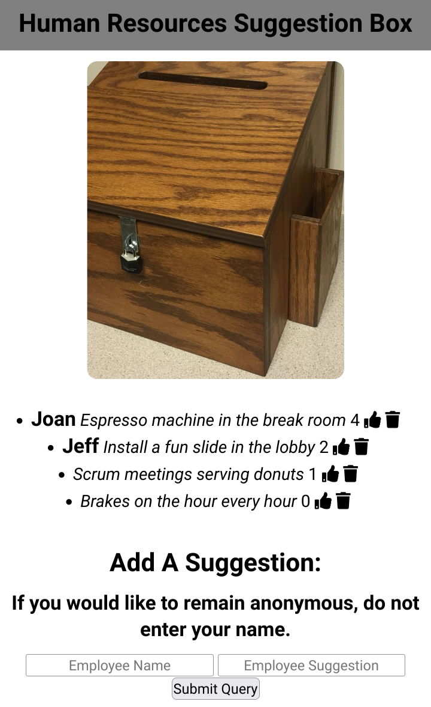

<td width="50%" valign="top"> <!--Set table to use 50% of the window for HR Box-->
      <h3 align="center">HR On-line Drop Box</h3>
        <!--Click on image and open a new window to the HR Box website-->
      
       
      
 
      </a> <!--Click on link to project website and open a new window to the HR Box website-->
      
      
 <!--Desription of technologies used and what the HR Box functionality -->
        
<strong>Javascript, MongoDb, Heroku, Node.js, & Express.js</strong> - A hosted full stack crud app project that allows users to submit like and delete HR suggestions.

    </td>